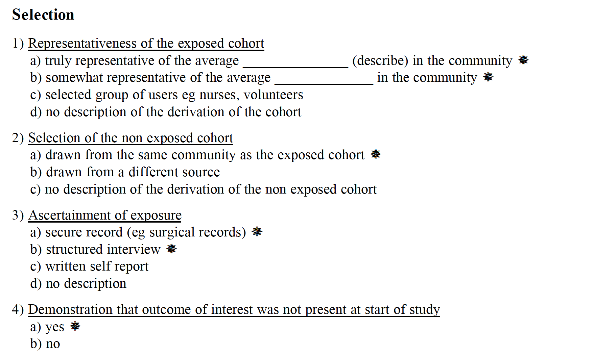
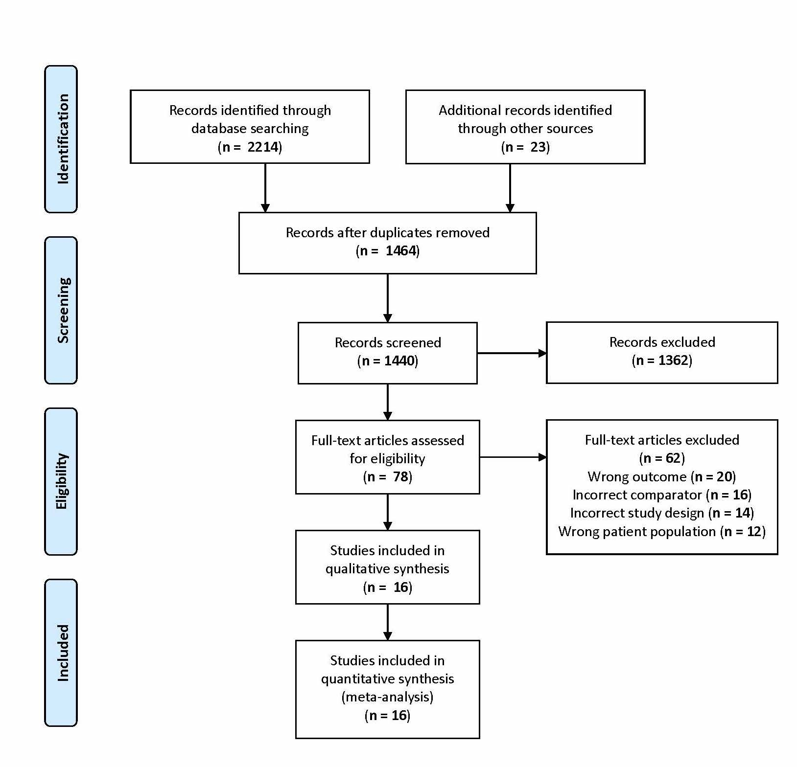
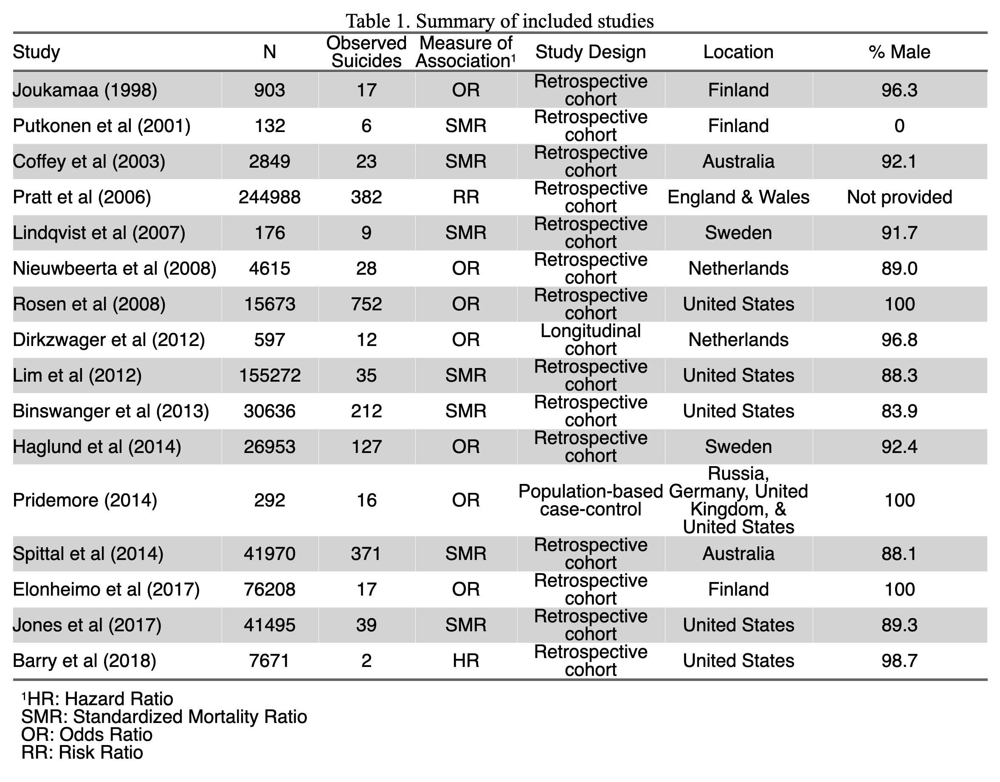
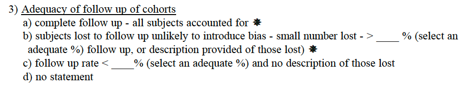
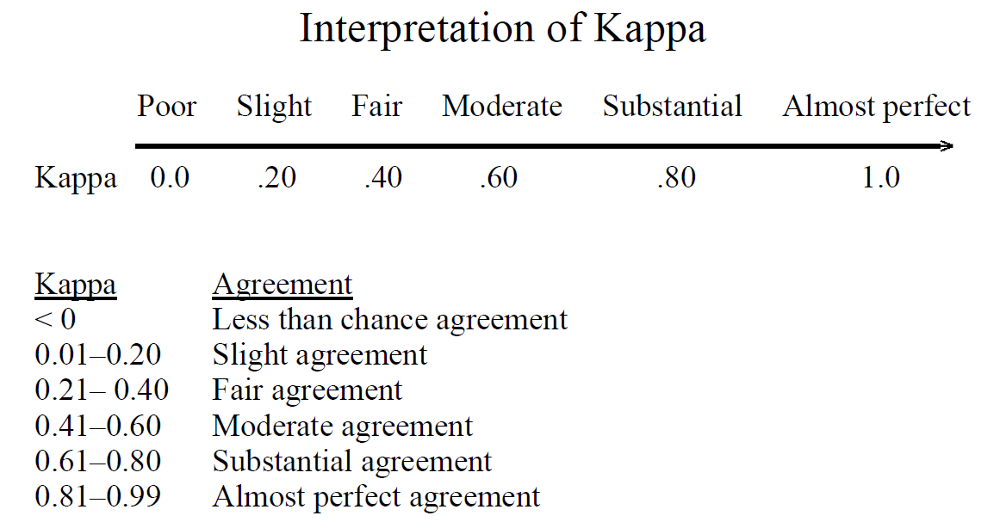

```{r xaringan-themer, include=FALSE, warning=FALSE}
library(xaringanthemer)
style_mono_accent(
  base_color = "#23395b",
  header_font_google = google_font("Josefin Sans"),
  text_font_google   = google_font("Montserrat", "500", "900i"),
  code_font_google   = google_font("Fira Mono")
)
```

```{r xaringan-tile-view, echo=FALSE}
xaringanExtra::use_tile_view()
```

<style>

.center2 {
  margin: 0;
  position: absolute;
  top: 50%;
  left: 50%;
  -ms-transform: translate(-50%, -50%);
  transform: translate(-50%, -50%);
}

</style>

```{r libraries, include=F, echo=F}
library(tidyverse)
library(rel)
library(flextable)
library(officer)
library(meta)
library(metafor)
library(dmetar)
```

## Background

World Prison Population List (2018)
- 10.74 million people are incarcerated throughout the world

- 145 per 100,000 persons

- United States leads with 655 per 100,000 persons

<br />

--

Previous incarceration

- Substantial burden of physical and psychiatric health problems relative to the general population

--

- Impact employment opportunities and social-emotional relationships

--

- Higher risk of all-cause mortality compared to those never imprisoned

--

- Little focus on suicide outcomes

---

.center2[
**Objective:** To systematically review and meta-analyze how exposure to previous imprisonment relates to suicide risk by comparing suicide deaths among those previously incarcerated to the general population
]

---

## Methods: Study eligibility criteria

- Reported suicide death among previously incarcerated persons compared to the general population without any psychiatric conditions

--

- General population had to be similar based on: 
  - age
  - gender
  - location
  - race/ethnicity

--

- Reported a measure of association or enough information to calculate an odds ratio

--

- No restriction on time or location

--

- Published in English

---
class: blue

## Methods: Information Sources

- PubMed, EMBASE, and PsychINFO were searched on October 30th, 2020

<br />

--

- Back and forward reference searching 

<br />

--

- Snowball searching techniques

---

## Methods: Search

<br />

(suicide\* OR ‘self harm’ OR ‘self mutilation’ OR suicidal\* OR ‘suicidal ideation’ OR ‘self-injury’ OR nssi OR self-destruct\* OR overdose OR ‘non-suicidal self injury’) 

<br />

.center[
AND 
]

<br />

(prison\* OR inmate\* OR penal OR correction\* OR sentence\* OR remand OR detainee\* OR felon\* OR incarcerated\*)

---

## Methods: Study selection

- Studies were evaluated first at the title / abstract level, later as full-text

<br />

--

- Two reviewers made assessments at evaluation stage
  - When disagreements occurred, reviewers discussed until a consensus was made

<br />

--

- Cohen's kappa was calculated for each stage to measure inter-rater reliability

---

## Methods: Data collection process

- Data extraction occurred via a spreadsheet and followed a coding manual 

<br />

--

- When standard errors were missing the following formula was used to derive the standard error by using the 95% confidence interval:

  - lower limit = ln(lower confidence limit given for a given ratio)
  - upper limit = ln(upper confidence limit given for a given ratio)
  - standard error = (upper limit - lower limit) / 3.92

<br />

--

- Studies without both the standard error and confidence intervals were not included

---

## Methods: Risk of bias in individual studies

.center[
.top[ 
**Newcastle Ottawa Quality Assessment Scale:** 

**(1)** Selection **(2)** Comparability **(3)** Outcome ]
]

--

.center[
.bottom[  ]
]

---

## Methods: Synthesis of results

- Differences due to:

  - study designs
  - time periods
  - locations
  - measures of association

<br />

--

- Random effects meta-analysis was used to pool effect sizes

<br />

--

- Heterogeneity between studies was assessed with the $I^{2}$ statistic

  - Describes the % variation across studies that is due to heterogeneity rather than chance
  
---

## Methods: Risk of bias across studies

- Visual inspection of funnel plots for asymmetry were performed

  - Fill-and-trim method was also applied to funnel plots to estimate potentially missing studies
  
---

## Results: PRISMA 

.center[

]

---



---

## Results: Risk of bias within studies

Newcastle Ottawa Quality Assessment Scale

- All studies had low risk of bias for *selection*

--

- All studies had low risk of bias for *comparability*

--

- Nearly half of the studies had a high risk of bias for *outcome* due to no follow-up statement

<br />
<br />
<br />



---

## Cohen's kappa(s)

.center[
.top[  ]
]

--

.bottom[
- Title/abstract screening: **K = 0.64** (95% CI: 0.55, 0.75)

- Full-text review: **K = 0.66** (95% CI: 0.49, 0.83)

- Bias assessment: **K = 0.82** (95% CI: 0.72, 0.92)
]

---

## Results: Forest plot, random-effect model

.center[
```{r fig_2, echo=F, fig.width=8, fig.height=5, dpi=200}
dat <- readRDS("../data/processed_data.rds") %>% arrange(yi) # sort by effect size
model_2 <- metagen(yi,                                    # effect size / TE
                  vi,                                     # variance / seTE
                  data = dat,
                  studlab = paste(author),
                  comb.fixed = FALSE,
                  comb.random = TRUE,
                  prediction = TRUE,
                  method.tau = "PM",
                #  backtransf = FALSE,
                  sm = "OR")

#grid.text("My custom title", .5, .9, gp=gpar(cex=2))

forest(model_2,
       xlim = c(0.1, 450),
       at = c(0.5, 1, 2, 3, 5, 10, 25, 425),
       col.predict = "#02a4d3",
       col.predict.lines = "#02a4d3",
       leftcols = c("studlab", "N"),
       just = "center",
       print.tau2 = FALSE,
       prediction = FALSE,
       col.random = "#e0115f",   # random effects dotted line
       col.diamond = "#e0115f")#,
     #  backtransf = FALSE)       # log odds

#summary(model_2)
```
]

---

## Results: Funnel plot of random-effects meta-analysis with all studies

.center[
```{r fig_5, echo=F, message=F, dpi=70}
res2 <- rma(yi, vi, data=dat, measure="OR")
taf2 <- trimfill(res2)
funnel(taf2, legend = TRUE)
```
]

---

## Conclusions

- Previously incarcerated persons are at an extremely high risk for suicide when compared to the general population

--

- The high degree of heterogeneity creates uncertainty about the effect strength

--

- However, the effect is clearly away from the null

--

- Very few high quality studies across two decades


---

.pull-left[

## Strengths

- Systematically captured two decades worth of research

- One of the first studies to meta-analyze suicide risk among previously incarcerated persons

- Affirms that previous incarceration increases the risk for suicide

- Highlights the heterogeneity in the literature
]

--

.pull-right[

## Limitations

- High income Western countries were the main representation in this sample

- The majority of the sample was male

- Substantial differences in study design limit generalizability

- Retrospective cohort designs with death record-linkage provide limited variables
]

---

.center2[
There is a shared responsibility with the prison system and social services to develop better collaboration for these vulnerable persons. Greater scrutiny is needed to determine how to fundamentally improve the prison system or move away from incarceration altogether.]

---

## Many thanks: 

.left[
- John Colford

- Mahasin Mujahid

- Mi-Suk Kang Dufour

- Navya Pothamsetty

- Katie Patrick

- Epi/Bio Cohort
]

---

## Appendix: Forest plot, random-effects model: OR, risk, hazard ratios only

.center[
```{r fig_3, echo=F, fig.width=8, fig.height=5, dpi=200}
ratios_only <- dat %>%
  filter(association %in% c("OR", "RR", "HR"))


model_3 <- metagen(yi,                      # effect size / TE
                  vi,                       # variance / seTE
                  data = ratios_only,
                  studlab = paste(author),
                  comb.fixed = FALSE,
                  comb.random = TRUE,
                  prediction = TRUE,
                  method.tau = "PM",
          #        backtransf = FALSE,
                  sm = "OR")


forest(model_3,
       xlim = c(0.1, 15),
       at = c(0.5, 1, 2, 3, 5, 10, 15),
       col.predict = "#02a4d3",
       col.predict.lines = "#02a4d3",
       leftcols = c("studlab", "N"),
       just = "center",
       print.tau2 = FALSE,
       prediction = FALSE,
       col.random = "#007ba7",   # random effects dotted line
       col.diamond = "#007ba7")
```
]

---

## Appendix: Forest plot, random-effects model: SMRs only

.center[
```{r fig_4, echo=F,  fig.width=8, fig.height=5, dpi=200}
smrs_only <- dat %>%
  filter(association == "SMR")

model_4 <- metagen(yi,                      # effect size / TE
                  vi,                       # variance / seTE
                  data = smrs_only,
                  studlab = paste(author),
                  comb.fixed = FALSE,
                  comb.random = TRUE,
                  prediction = TRUE,
                  method.tau = "PM",
                 # backtransf = FALSE,
                  sm = "OR")

#model_4
forest(model_4,
       xlim = c(0.1, 450),
       at = c(0.5, 1, 2, 3, 5, 10, 25, 425),
       col.predict = "#02a4d3",
       col.predict.lines = "#02a4d3",
       leftcols = c("studlab", "N"),
       just = "center",
       print.tau2 = FALSE,
       prediction = FALSE,
       col.random = "#00b374",   # random effects dotted line
       col.diamond = "#00b374")#,

```
]

---

## Appendix: Sensitivity analysis on the random-effects model with all studies included

```{r, echo=F, include=F, message=F}
model_2_inf <- InfluenceAnalysis(model_2, random = TRUE, 
                                 return.separate.plots = TRUE,
                                 forest.lims = c(2, 46))
```

.center[
```{r, echo=F, message=F, fig.width=7, fig.height=5, dpi=85}
plot(model_2_inf, "es")
```
]